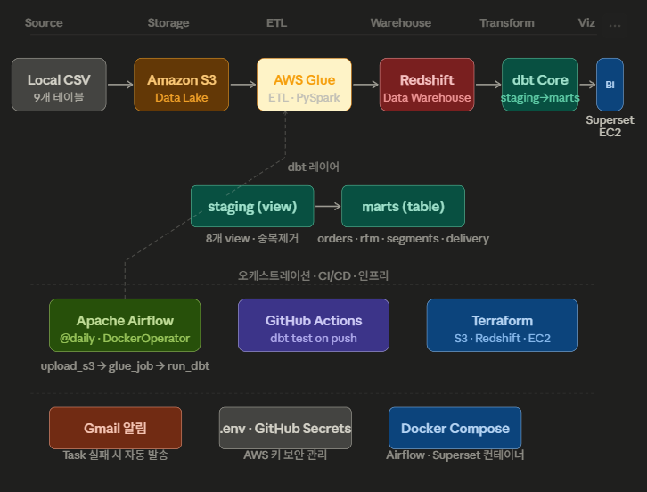

# 🛒 Olist AWS Pipeline

> 브라질 이커머스 데이터 기반 AWS 엔드투엔드 배치 파이프라인

[](https://python.org)
[](https://aws.amazon.com/glue)
[](https://aws.amazon.com/redshift)
[](https://airflow.apache.org)
[](https://getdbt.com)
[](https://terraform.io)
[](https://github.com/JaeHyun-Ahn98/olist-aws-pipeline/actions)

---

## 📊 대시보드

> 비용 절감을 위해 AWS 리소스(Redshift, EC2)는 현재 중지 상태입니다.

---

## 🏗️ 아키텍처



```
Local CSV (Olist 9개 테이블)
 └→ Python (S3 업로드)
      └→ Amazon S3 (Data Lake)
           └→ AWS Glue ETL (S3 → Redshift 적재 · PySpark)
                └→ Amazon Redshift (Data Warehouse)
                     └→ dbt Core (staging → marts 변환)
                          └→ Apache Superset (시각화 · EC2 배포)

오케스트레이션: Apache Airflow (@daily · Docker · DockerOperator)
CI/CD:         GitHub Actions (push 시 dbt test 자동 실행)
인프라:         Terraform (S3 · Redshift · EC2 IaC 관리)
```

---

## 🎯 프로젝트 배경 & 목적

[첫 번째 프로젝트 (GCP 기반)](https://github.com/JaeHyun-Ahn98/mes-sensor-pipeline)에서 아쉬웠던 점 3가지를 이번 프로젝트에서 직접 보완했습니다.

| 1번 프로젝트 아쉬운 점 | 2번 프로젝트 해결 방법 |
|---|---|
| 데이터 품질 자동 검증 없음 | dbt test 10개 + GitHub Actions CI/CD |
| 파이프라인 실패 알림 없음 | Airflow Gmail SMTP 이메일 알림 |
| 대시보드 로컬에서만 접근 가능 | EC2에 Superset 직접 배포 → 외부 URL |

GCP → AWS로 클라우드를 전환해 **멀티클라우드 경험**을 확보했습니다.

---

## 💡 기술 선택 이유

| 기술 | 선택한 이유 |
|---|---|
| **AWS Glue** | S3 데이터를 Redshift로 옮기는 서버리스 ETL. PySpark 문법 그대로 사용 가능하여 1번 프로젝트 경험 재활용 |
| **Amazon Redshift** | 컬럼형 DWH로 대용량 분석 쿼리 최적화. AWS 생태계와 자연스러운 연동 |
| **dbt Core** | SQL로 staging → marts 계층 변환. 테스트 기능으로 데이터 품질 자동 검증 |
| **Airflow (Docker)** | 전체 파이프라인 @daily 자동화. DockerOperator로 dbt 의존성 격리 해결 |
| **DockerOperator** | dbt-redshift를 Airflow 이미지에 직접 설치 시 의존성 충돌 발생 → 공식 이미지로 격리 |
| **GitHub Actions** | push 시 dbt test 자동 실행. GitHub Secrets로 Redshift 접속 정보 안전하게 관리 |
| **Superset (EC2)** | 오픈소스 BI 툴. EC2에 직접 배포해 외부에서 접근 가능한 URL 생성 |
| **Terraform** | S3, Redshift, EC2를 코드로 관리. 재현 가능한 인프라 구성 |

---

## 📁 데이터셋

- **출처:** [Brazilian E-Commerce Public Dataset by Olist (Kaggle)](https://www.kaggle.com/datasets/olistbr/brazilian-ecommerce)
- **규모:** 주문 10만 건 이상 · 9개 테이블 · 2016~2018년
- **주요 테이블:** orders, customers, order_items, order_payments, order_reviews, products, sellers, geolocation, category_translation

---

## 🔍 EDA 핵심 발견

### 1. RFM 분석 한계 인지 및 방향 수정

전체 고객 93,400명 중 **97%가 1회 구매 고객**임을 EDA에서 발견. Frequency 지표가 의미없는 상황을 파악하고 Recency와 Monetary 중심으로 고객 세그먼트 분류 방향 수정. 브라질 이커머스 초기 시장(2016~2018)의 낮은 재구매율이 원인임을 확인.

### 2. CSV 파싱 오류 발견 (dbt test)

dbt test 실행 중 `review_score` 컬럼에 날짜값이 혼재됨을 발견. review_comment_message에 쉼표 포함 시 Glue ETL이 컬럼을 밀려서 적재하는 문제. staging 레이어에서 `WHERE review_score ~ '^[1-5]$'` 필터로 처리. **테스트를 약하게 만드는 대신 upstream에서 처리하는 실무적 접근 채택.**

---

## 🔥 핵심 문제 해결 경험

### 1. Glue → Redshift 연결 에러 4연타

Glue ETL을 VPC 안에서 실행하면서 Redshift에 연결하려다 에러가 4번 연속으로 발생

- **53분 무한 대기**: Glue가 Redshift에 접근을 못해 응답 없이 계속 기다리는 상태
- **보안 그룹 에러**: Glue 내부 통신을 위한 self 참조 규칙 누락 → Terraform으로 추가
- **S3 접근 실패**: VPC 안에서 S3에 접근하려면 별도 엔드포인트 필요 → Terraform으로 추가
- **STS 인증 타임아웃**: VPC 안에서 AWS 인증 서비스 접근 불가로 계속 실패

결국 VPC Connection을 제거하고 Redshift의 public endpoint로 직접 연결하는 방식으로 전환해 해결. AWS 네트워크 구성은 VPC, 보안 그룹, 엔드포인트가 모두 맞아야 동작한다는 것을 직접 경험.

### 2. Glue 재실행 시 데이터 중복 적재

Glue Job을 여러 번 실행하면 같은 데이터가 계속 쌓이는 문제 발생. raw 테이블에 데이터가 6배씩 늘어남을 확인. dbt staging 모델에 `SELECT DISTINCT`를 추가해 dbt 변환 단계에서 중복을 걸러내는 방식으로 해결.

### 3. dbt + Airflow 의존성 충돌 → DockerOperator로 분리

Airflow 컨테이너에 dbt를 직접 설치하면 패키지 버전 충돌 발생. dbt 공식 Docker 이미지를 DockerOperator로 별도 실행하는 방식으로 전환. 각 도구를 독립된 컨테이너로 분리하면 버전 관리가 훨씬 명확해진다는 것을 확인.

### 4. Airflow에서 AWS 키 못 읽는 문제

DockerOperator에서 `{{ var.value.AWS_ACCESS_KEY_ID }}` 방식으로 AWS 키를 불러오려다 `KeyError` 발생. docker-compose.yml에서 이미 환경변수로 주입되어 있어서 `os.environ.get()`으로 읽는 방식으로 변경해 해결.

### 5. Superset에서 Redshift 연결 안 되는 문제

psycopg2 드라이버를 설치해도 Superset이 인식하지 못하는 문제 발생. Superset 컨테이너가 자체 Python 가상환경을 사용하기 때문에 일반 `pip install`로는 그 환경에 설치가 안 되는 구조였음. 관리자 권한으로 해당 가상환경에 직접 설치해 해결.

### 6. dbt test에서 데이터 오류 발견

dbt test 실행 중 리뷰 점수 컬럼에 날짜 값이 섞여 있는 문제 발견. CSV 파일에서 텍스트 안에 쉼표가 있으면 컬럼이 밀려서 잘못 들어가는 CSV 파싱 특성 때문. staging에서 유효하지 않은 값을 필터링해 해결.

---

## 📂 프로젝트 구조

```
olist-aws-pipeline/
├── infra/
│   ├── terraform/                      # AWS 리소스 (S3, Redshift, EC2, VPC)
│   └── docker/
│       ├── docker-compose.yml          # Airflow (webserver, scheduler, init, postgres)
│       ├── docker-compose.superset.yml # Superset
│       ├── Dockerfile.airflow          # boto3, airflow-providers-docker
│       └── Dockerfile.superset         # psycopg2, sqlalchemy-redshift
├── pipeline/
│   ├── extract/
│   │   └── upload_to_s3.py             # Local CSV → S3 업로드
│   ├── glue/
│   │   └── etl_olist.py                # S3 → Redshift ETL (AWS Glue Job)
│   └── airflow/dags/
│       └── olist_pipeline_dag.py       # DAG: upload_s3 → glue_job → run_dbt
├── transform/
│   └── olist_pipeline/
│       └── models/
│           ├── staging/                # 8개 view (원본 정제 · 중복 제거)
│           └── marts/                  # 4개 table (분석용 최종 테이블)
├── notebooks/                          # EDA Jupyter 노트북
├── .github/workflows/
│   └── dbt_test.yml                    # GitHub Actions CI (push → dbt test)
└── docs/
    └── architecture.png
```

---

## 🔧 dbt 모델 구조

### Staging (8개 View)

| 모델 | 주요 처리 |
|---|---|
| stg_orders | 컬럼명 정규화, 타입 변환, 중복 제거 |
| stg_customers | 중복 제거 |
| stg_order_items | 중복 제거 |
| stg_order_payments | 중복 제거 |
| stg_order_reviews | CSV 파싱 오류 필터링 (`review_score ~ '^[1-5]$'`) |
| stg_products | 중복 제거 |
| stg_sellers | 중복 제거 |
| stg_category_translation | 중복 제거 |

### Marts (4개 Table)

| 모델 | 설명 |
|---|---|
| mart_orders | 주문 + 결제 + 배송 통합 분석 테이블 |
| mart_rfm | 고객별 Recency · Frequency · Monetary 지표 |
| mart_customer_segments | VIP · Active · At-Risk · Lost 고객 세그먼트 분류 |
| mart_delivery_analysis | 실제 배송일 vs 예상 배송일 · 지연 여부 분석 |

---

## 📊 주요 인사이트

- **고객 세그먼트:** VIP 4,257명(avg $923) · Active 36,126명 · At-Risk 33,054명 · Lost 19,913명
- **결제 수단:** credit_card 74% · boleto(브라질 전통 결제) 19% · voucher 5%
- **1회 구매 비율:** 전체 93,400명 중 97% (브라질 이커머스 초기 시장 특성)
- **배송 지연:** SP(상파울루), RJ(리우데자네이루) 지역 최다 지연 발생

---

## ⚙️ 실행 방법

### 1. 사전 준비

```bash
git clone https://github.com/JaeHyun-Ahn98/olist-aws-pipeline.git
cd olist-aws-pipeline
python -m venv venv
venv\Scripts\activate  # Windows
pip install -r requirements.txt
```

### 2. AWS 인프라 생성

```bash
cd infra/terraform
terraform init
terraform apply
```

### 3. 환경변수 설정

```bash
# infra/docker/.env 파일 생성
AWS_ACCESS_KEY_ID=your-access-key
AWS_SECRET_ACCESS_KEY=your-secret-key
AWS_DEFAULT_REGION=ap-northeast-2
GMAIL_USER=your-email@gmail.com
GMAIL_APP_PASSWORD=your-app-password
```

### 4. Airflow 실행

```bash
cd infra/docker
docker compose up airflow-init   # "User admin created" 확인 후 Ctrl+C
docker compose up -d
# localhost:8080 → olist_pipeline DAG Trigger
```

### 5. Superset 실행 (로컬)

```bash
cd infra/docker
docker compose -f docker-compose.superset.yml up -d
# localhost:8088 → admin/admin
```

### 6. dbt 수동 실행

```bash
cd transform/olist_pipeline
dbt run
dbt test
```

---

## 🔧 기술 스택

| 구분 | 기술 |
|---|---|
| 스토리지 | Amazon S3 (Data Lake) |
| ETL | AWS Glue (PySpark) |
| 데이터 웨어하우스 | Amazon Redshift |
| 데이터 변환 | dbt Core 1.9.0 |
| 시각화 | Apache Superset (EC2 배포) |
| 오케스트레이션 | Apache Airflow 2.9.0 (Docker) |
| CI/CD | GitHub Actions |
| 인프라 | Terraform, Docker |
| 언어 | Python 3.10 |

---

## 👨‍💻 개발 환경

- **OS:** Windows 10
- **Python:** 3.10.11
- **Docker Desktop:** 4.x
- **AWS:** S3, Glue, Redshift, EC2 (ap-northeast-2 서울 리전)